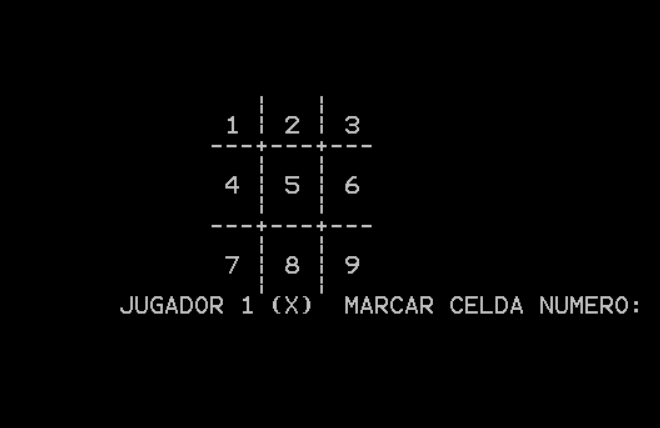

# Tic-Tac-Toe in x86 Assembly

[](https://github.com/Geovanni-Gonzalez/TicTacToe-x86-ASM/actions/workflows/ci.yml)
-blue)


**[Leer en español](docs/README.es.md)**

A two-player Tic-Tac-Toe game written entirely in **16-bit x86 assembly** for MS-DOS. There are no libraries and no OS abstractions: screen rendering, cursor control, keyboard input and all game logic are implemented directly on top of BIOS (`INT 10h`) and DOS (`INT 21h`) interrupts.

Built as the second project for *Fundamentals of Computer Organization* (Computer Engineering).



## Features

- **Interactive console UI** — welcome screen, ASCII board rendered with precise cursor positioning, and per-turn prompts.
- **Complete game engine** — turn alternation between players X and O, win detection across all 8 winning lines (3 rows, 3 columns, 2 diagonals) and draw detection.
- **Robust input handling** — rejects keys outside `1-9` and cells that are already taken, with on-screen feedback and no lost turns.
- **Clean termination** — end-of-game messages (winner or draw) and proper exit through DOS service `4Ch`.

## How it works

The board is stored as nine one-byte variables (`C1`–`C9`). Each byte holds either the ASCII digit of the cell (`'1'`–`'9'`) or a player marker (`'X'` / `'O'`). This single representation drives everything:

- **Rendering** prints each byte as-is, so free cells show their number and taken cells show the marker.
- **Occupancy check** is a comparison against `'X'`/`'O'`.
- **Win detection** compares the three bytes of each line for equality — if a line is uniform it can only be three identical markers, since free cells hold distinct digits.

The full walkthrough of the data segment, control flow and design decisions is in [`docs/ARCHITECTURE.md`](docs/ARCHITECTURE.md).

## Running the game

### Option A — EMU8086 (recommended)

1. Install [EMU8086](https://emu8086-microprocessor-emulator.en.softonic.com/).
2. Open `src/tictactoe.asm`.
3. Press **Emulate**, then **Run**.

### Option B — DOSBox + TASM/MASM

```bat
REM Turbo Assembler
tasm tictactoe.asm
tlink tictactoe.obj
tictactoe.exe

REM or Microsoft Macro Assembler
masm tictactoe.asm;
link tictactoe.obj;
tictactoe.exe
```

### Playing

Players take turns typing a cell number (`1`–`9`). Player 1 places `X`, player 2 places `O`. The game announces the winner or a draw and exits.

```txt
   |   |
 1 | 2 | 3
---+---+---
   |   |
 4 | X | 6
---+---+---
   |   |
 7 | 8 | O
   |   |
```

## Project structure

```txt
TicTacToe-x86-ASM/
├── src/
│   └── tictactoe.asm        Full game source (16-bit x86, MASM syntax)
├── docs/
│   ├── ARCHITECTURE.md      Technical documentation (English)
│   ├── ARCHITECTURE.es.md   Technical documentation (Spanish)
│   └── assignment.es.md     Original course assignment (Spanish)
├── docs/img/                Screenshots of the running game
├── .github/workflows/       CI: repository and source validation
├── project-info.json        Bilingual project metadata
└── README.md / README.es.md
```

## Development notes

While preparing this repository for publication, a copy-paste bug in the original submission was found and fixed: the bottom-row win check (`VERIFICAR3`) compared cells 4-5-6 instead of 7-8-9, so a win on the bottom row was never detected. See commit history for details.

## Authors

Academic project developed in pair:

- **Geovanni Gonzalez Aguilar** — [@Geovanni-Gonzalez](https://github.com/Geovanni-Gonzalez)
- **Jimena Mendez Morales**

## License

All rights reserved — see [LICENSE](LICENSE). The code is published for portfolio and reference purposes.
