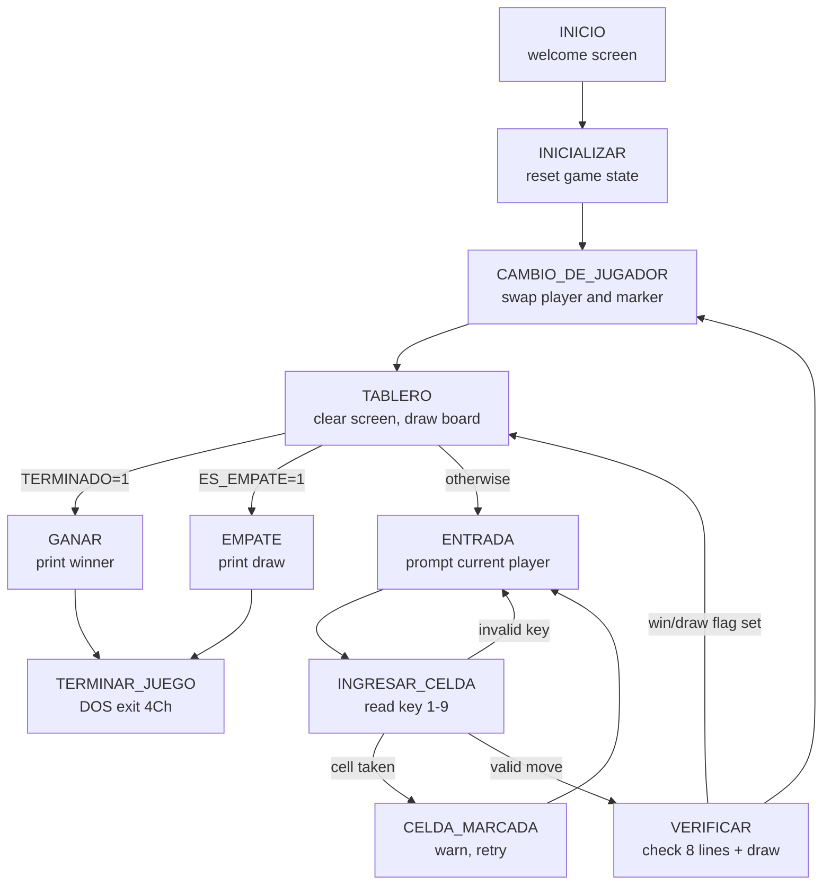

# Technical Documentation — Tic-Tac-Toe in x86 Assembly

**[Versión en español](ARCHITECTURE.es.md)**

This document explains the internals of [`src/tictactoe.asm`](../src/tictactoe.asm): the data structures, the control flow, the key routines and the design decisions behind them.

## Environment

| Aspect | Value |
|---|---|
| Architecture | x86 real mode, 16-bit |
| Memory model | `.MODEL SMALL` (one code segment, one data segment) |
| Assembler syntax | MASM/TASM compatible (developed on EMU8086) |
| Video services | BIOS `INT 10h` (cursor positioning `AH=2`, screen scroll/clear `AH=6`) |
| DOS services | `INT 21h` (`AH=9` print string, `AH=2` print char, `AH=1` read char with echo, `AH=7` read char without echo, `AH=4Ch` exit) |

## Data structures

The entire game state lives in the data segment as single-byte variables. There are no arrays, no stack frames and no dynamic memory.

| Variable | Initial value | Purpose |
|---|---|---|
| `C1`…`C9` | `'1'`…`'9'` | The nine board cells. Each holds either its own ASCII digit (free) or `'X'`/`'O'` (taken). |
| `JUGADOR` | `'2'` (50) | Current player as an ASCII digit; initialized to 2 so the first switch makes player 1 start. |
| `MARCADOR_ACTUAL` | 88 (`'X'`) | Marker to place on the next valid move. |
| `MOVIMIENTOS` | 0 | Count of valid moves; 9 moves with no winner means a draw. |
| `TERMINADO` | 0 | Flag set to 1 when a winning line is found. |
| `ES_EMPATE` | 0 | Flag set to 1 when the board is full with no winner. |

The remaining `DB` definitions are `$`-terminated strings for the UI (welcome screen, prompts, error and end-of-game messages) and the three building blocks used to draw the board (`LINEA1`, `LINEA2`, `LINEA3`).

**Why one byte per cell?** Storing either the digit or the marker in the same byte gives three properties at once: printing a cell requires no translation, checking occupancy is two comparisons (`'X'`?, `'O'`?), and win checking reduces to equality of three bytes — a free line can never look uniform because free cells hold distinct digits.

## Control flow

The program is a state machine driven by unconditional jumps between labeled sections (a common style for small DOS-era programs):

### Section by section

**`INICIO`** draws the welcome screen: title, developer credits and a "press any key" prompt, using `INT 10h AH=2` to position the cursor before each `INT 21h AH=9` string print. Input is read with `AH=7` (no echo) so the pressed key does not pollute the screen.

**`INICIALIZAR`** resets all state variables and reloads `C1`…`C9` with their ASCII digits, then jumps into the turn cycle.

**`CAMBIO_DE_JUGADOR`** toggles `JUGADOR` between `'1'` and `'2'` and sets `MARCADOR_ACTUAL` to `'X'` or `'O'` accordingly.

**`TABLERO`** clears the screen (`LIMPIAR_PANTALLA`) and redraws the full board from the current cell bytes. The grid is composed from three reusable strings — a blank row segment, the `---+---+---` separator and the ` | ` divider — with the cell bytes printed in between. After drawing, it checks the `TERMINADO` and `ES_EMPATE` flags and branches to the corresponding end screen; otherwise the game continues into `ENTRADA`. Rendering the board *before* checking the flags guarantees the final winning/drawing position is visible on the end screen.

**`ENTRADA` / `INGRESAR_CELDA`** prints the current player and marker, then reads one key with `INT 21h AH=1`. The ASCII code is converted to a number (`SUB BL, 48`) and dispatched with a `CMP`/`JZ` chain to the per-cell handlers `C1U`…`C9U`. Anything outside `1-9` falls through to the invalid-input path, which decrements `MOVIMIENTOS` back (it was optimistically incremented), shows an error and returns to `ENTRADA`.

**`C1U`…`C9U`** check whether the chosen cell already holds `'X'` or `'O'`. If so, control goes to `CELDA_MARCADA`, which warns the player, reverts the move counter and retries the same player's turn. Otherwise the cell byte is overwritten with `MARCADOR_ACTUAL` and control flows to `VERIFICAR`.

**`VERIFICAR` (`VERIFICAR1`…`VERIFICAR8`)** tests the eight winning lines — rows 1-2-3, 4-5-6, 7-8-9; columns 1-4-7, 2-5-8, 3-6-9; diagonals 1-5-9, 3-5-7. Each check loads the three cell bytes into `AL`/`BL`/`CL` and requires two equalities; the first mismatch jumps to the next check. A uniform line sets `TERMINADO=1`. If no line matches, `VERIFICAR_EMPATE` declares a draw when `MOVIMIENTOS` reaches 9. In all cases control returns through `CAMBIO_DE_JUGADOR` or `TABLERO`, so the flags are acted on right after the board is redrawn.

**`GANAR` / `EMPATE`** print the outcome. The winner's number is simply `JUGADOR`: when a win is detected, `VERIFICAR` jumps straight to `TABLERO`, skipping `CAMBIO_DE_JUGADOR`, so the variable still identifies the player who made the winning move.

**`TERMINAR_JUEGO`** exits cleanly via `INT 21h AH=4Ch`, returning control to DOS.

**`LIMPIAR_PANTALLA`** is the only true procedure (called with `CALL`/`RET`). It clears the screen by scrolling the whole 80×25 text window (`INT 10h AH=6`, `AL=0`, corners `0,0`–`24,79`, attribute `07h`).

## Design decisions

- **Label-driven flow instead of procedures.** Except for `LIMPIAR_PANTALLA`, the program uses labels and `JMP` rather than `PROC`/`CALL`. With a single global state and no reentrancy, this avoids stack management entirely — a deliberate simplification typical of 16-bit real-mode programs.
- **Optimistic move counting.** `MOVIMIENTOS` is incremented as soon as a key is read and decremented on the invalid/occupied paths. This keeps the happy path shortest.
- **Unrolled checks.** Both the cell dispatch (`C1U`…`C9U`) and the win checks (`VERIFICAR1`…`VERIFICAR8`) are fully unrolled. Indexed addressing over a 9-byte array would be more compact, but the unrolled version keeps every branch explicit and easy to trace in a debugger — valuable in an academic setting where the goal is demonstrating mastery of the instruction set.

## Known limitations

- No option to replay without restarting the program.
- Input reads a single key, so multi-digit or accidental input beyond the first key is ignored by design.
- The UI layout uses fixed cursor coordinates and assumes the standard 80×25 text mode.

## Historical note

The original course submission contained a copy-paste bug: `VERIFICAR3` (bottom row 7-8-9) compared `C4`/`C5`/`C6`, so bottom-row wins were never detected. This was fixed when the source was restored to this repository (see commit history).
